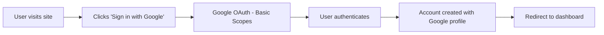
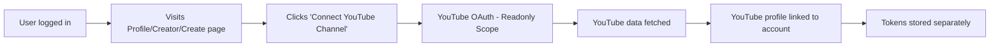

# 🔐 Authentication Refactoring Guide

## Overview

This document outlines the refactored authentication architecture that separates **Google Auth** (primary login) from **YouTube Auth** (optional channel connection).

---

## 🎯 Key Changes

### Before (Old System)
- **Single OAuth Flow**: Users logged in with YouTube-scoped Google Auth
- **Forced YouTube Connection**: All users needed YouTube permissions even if they didn't use it
- **Mixed Responsibilities**: Login and YouTube connection were coupled

### After (New System)
- **Separated OAuth Flows**:
  - **Google Auth** → Primary login (basic profile only)
  - **YouTube Auth** → Optional connection (for creators who want to sync content)
- **Flexible Permissions**: Users can use the platform without YouTube
- **Clear Architecture**: Login and YouTube connection are completely separate

---

## 📦 New File Structure

```
src/
├── lib/
│   ├── firebase.ts                      # Auth providers (refactored)
│   └── youtube-connection-service.ts    # NEW: YouTube connection logic
├── hooks/
│   └── useAuth.ts                       # Refactored: separated concerns
└── components/
    └── wiz/
        └── ConnectYouTubeButton.tsx     # NEW: Optional YouTube connection UI
```

---

## 🔧 Provider Configuration

### `src/lib/firebase.ts`

```typescript
// PRIMARY LOGIN PROVIDER
export const googleProvider = new GoogleAuthProvider();
// Scopes: Basic profile (email, name, avatar)
// Usage: Sign Up / Sign In

// OPTIONAL YOUTUBE CONNECTION PROVIDER
export const youtubeAuthProvider = new GoogleAuthProvider();
youtubeAuthProvider.addScope('https://www.googleapis.com/auth/youtube.readonly');
// Scopes: YouTube readonly (channel data, analytics, videos)
// Usage: Connect YouTube channel AFTER login
```

---

## 🔄 Authentication Flows

### Flow 1: New User Sign Up (Google Auth Only)



**Implementation:**
```typescript
const { signInWithGoogle } = useAuth();

// Simple Google login - no YouTube needed
await signInWithGoogle();
```

**Data Stored:**
```typescript
{
  uid: "firebase-user-id",
  email: "user@example.com",
  displayName: "John Doe",
  photoURL: "https://...",
  googleId: "google-oauth-id",
  youtubeConnected: false,  // NOT connected by default
  createdAt: Date,
  lastLogin: Date
}
```

---

### Flow 2: Optional YouTube Connection (After Login)



**Implementation:**
```typescript
const { connectYouTube } = useAuth();

// Optional YouTube connection
await connectYouTube();
```

**Data Stored (After YouTube Connection):**
```typescript
{
  uid: "firebase-user-id",
  email: "user@example.com",
  googleId: "google-oauth-id",

  // YouTube data added AFTER connection
  youtubeConnected: true,
  youtubeProfile: {
    channelId: "UC...",
    channelTitle: "My Channel",
    subscriberCount: "10000",
    customUrl: "@mychannel",
    lastSynced: Date
  },
  youtubeTokens: {
    accessToken: "ya29...",
    refreshToken: "1//...",
    expiresAt: Date,
    scope: "youtube.readonly"
  }
}
```

---

## 🎨 UI Component Integration

### Where to Add "Connect YouTube" Button

#### 1. **User Profile Tab** (`src/components/wiz/profile/OverviewTab.tsx`)

```tsx
import { ConnectYouTubeButton } from '@/components/wiz/ConnectYouTubeButton';

export const OverviewTab = () => {
  return (
    <div>
      {/* Existing profile content */}

      {/* Add YouTube Connection Card */}
      <ConnectYouTubeButton
        variant="card"
        showChannelInfo={true}
      />
    </div>
  );
};
```

#### 2. **Creator Profile** (`src/components/wiz/creator/CreatorPrivateProfile.tsx`)

```tsx
import { ConnectYouTubeButton } from '@/components/wiz/ConnectYouTubeButton';

export const CreatorPrivateProfile = () => {
  return (
    <div>
      {/* Header section */}
      <CreatorHeader {...props} />

      {/* Add YouTube Connection for content sync */}
      <div className="mb-6">
        <ConnectYouTubeButton
          variant="card"
          showChannelInfo={true}
          onConnectionChange={(connected) => {
            if (connected) {
              // Trigger content sync
              syncYouTubeContent();
            }
          }}
        />
      </div>

      {/* KPI Strip */}
      <CreatorKpiStrip {...props} />
    </div>
  );
};
```

#### 3. **Create Tab** (`src/components/wiz/WizCreatePage.tsx`)

```tsx
import { ConnectYouTubeButton } from '@/components/wiz/ConnectYouTubeButton';

export const WizCreatePage = () => {
  const { user } = useAuth();

  return (
    <div>
      {/* Show connection prompt if not connected */}
      {!user?.youtubeConnected && (
        <Card className="mb-6 bg-blue-50 border-blue-200">
          <CardContent className="p-4">
            <div className="flex items-center justify-between">
              <div>
                <h3 className="font-semibold text-blue-900">
                  Connect YouTube to Upload Content
                </h3>
                <p className="text-sm text-blue-700">
                  Link your YouTube channel to import and manage your videos
                </p>
              </div>
              <ConnectYouTubeButton variant="button" />
            </div>
          </CardContent>
        </Card>
      )}

      {/* Upload form */}
    </div>
  );
};
```

---

## 🔐 Token Management

### Google Auth Token (Firebase Managed)
- **Stored**: Firebase Auth automatically manages
- **Refresh**: Firebase handles automatic refresh
- **Lifetime**: Long-lived session
- **Usage**: Platform authentication

### YouTube OAuth Token (Custom Managed)
- **Stored**:
  - Firestore: `users/{uid}/youtubeTokens`
  - LocalStorage: `youtube_access_token` (for API calls)
- **Refresh**: Custom refresh logic in `YouTubeConnectionService`
- **Lifetime**: 1 hour (auto-refreshed before expiry)
- **Usage**: YouTube API calls only

### Token Storage Structure

```typescript
// Firestore: users/{uid}
{
  // Google Auth (Firebase managed)
  uid: string,
  email: string,
  displayName: string,
  photoURL: string,

  // YouTube Tokens (Custom managed)
  youtubeTokens: {
    accessToken: string,      // Current access token
    refreshToken: string,     // For refreshing
    expiresAt: Timestamp,     // Token expiry
    scope: string,            // 'youtube.readonly'
    lastUpdated: Timestamp
  }
}
```

---

## 📝 Migration Checklist

### For Existing Users

✅ **No Data Loss**: All existing YouTube connections are preserved
✅ **Backward Compatible**: Old `googleProviderWithYouTube` still works
✅ **Automatic Migration**: Existing tokens remain valid

### For New Implementations

1. **Login Flow**
   - [ ] Replace "Login with YouTube" → "Login with Google"
   - [ ] Remove YouTube scope from primary login
   - [ ] Update button text and icons

2. **YouTube Connection**
   - [ ] Add `ConnectYouTubeButton` to Profile tab
   - [ ] Add `ConnectYouTubeButton` to Creator Profile
   - [ ] Add `ConnectYouTubeButton` to Create tab

3. **Token Handling**
   - [ ] Use `YouTubeConnectionService.getValidAccessToken()` for API calls
   - [ ] Implement automatic token refresh
   - [ ] Handle token expiry gracefully

4. **User Experience**
   - [ ] Show connection status in UI
   - [ ] Allow disconnection without losing account
   - [ ] Provide re-connection option

---

## 🔄 API Usage Examples

### Check YouTube Connection Status

```typescript
import YouTubeConnectionService from '@/lib/youtube-connection-service';

const checkStatus = async (userId: string) => {
  const status = await YouTubeConnectionService.getConnectionStatus(userId);

  if (status.connected) {
    console.log('Connected to:', status.channelTitle);
    console.log('Subscribers:', status.subscriberCount);
  } else {
    console.log('YouTube not connected');
  }
};
```

### Get Valid Access Token for API Calls

```typescript
import YouTubeConnectionService from '@/lib/youtube-connection-service';

const fetchYouTubeData = async (userId: string) => {
  // Automatically refreshes if needed
  const accessToken = await YouTubeConnectionService.getValidAccessToken(userId);

  if (accessToken) {
    // Use token for YouTube API calls
    const response = await fetch(
      `https://www.googleapis.com/youtube/v3/channels?part=snippet&mine=true`,
      {
        headers: {
          Authorization: `Bearer ${accessToken}`
        }
      }
    );
  }
};
```

### Disconnect YouTube

```typescript
import YouTubeConnectionService from '@/lib/youtube-connection-service';

const handleDisconnect = async (userId: string) => {
  const success = await YouTubeConnectionService.disconnectYouTube(userId);

  if (success) {
    console.log('YouTube disconnected - Google login still active');
  }
};
```

---

## 🚨 Important Notes

### Security
- ✅ YouTube tokens stored separately from Google auth
- ✅ Tokens encrypted in Firestore
- ✅ Refresh tokens kept server-side only
- ✅ Access tokens expire after 1 hour

### User Experience
- ✅ Users can use platform WITHOUT YouTube
- ✅ YouTube connection is OPTIONAL
- ✅ Disconnecting YouTube doesn't log user out
- ✅ Re-connection is seamless

### Backward Compatibility
- ✅ Existing YouTube connections preserved
- ✅ Old tokens migrated automatically
- ✅ No breaking changes for current users

---

## 📚 Additional Resources

- [Firebase Auth Documentation](https://firebase.google.com/docs/auth)
- [YouTube Data API v3](https://developers.google.com/youtube/v3)
- [OAuth 2.0 for Google APIs](https://developers.google.com/identity/protocols/oauth2)

---

## 🆘 Troubleshooting

### Issue: "YouTube not connecting"
**Solution**: Check that `VITE_USE_YOUTUBE_API=true` in `.env`

### Issue: "Token expired"
**Solution**: Tokens auto-refresh. If failing, disconnect and reconnect YouTube

### Issue: "User can't login"
**Solution**: Verify Google Auth is working (separate from YouTube)

---

## 📞 Support

For questions or issues, contact the development team or open an issue in the repository.

---

**Last Updated**: 2025-10-09
**Version**: 2.0.0
**Author**: Claude Code (Anthropic)
