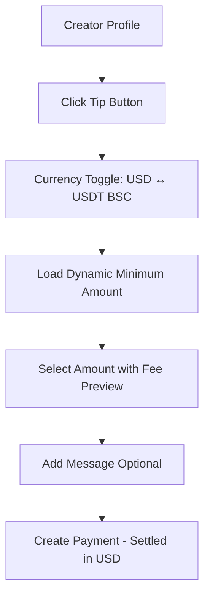
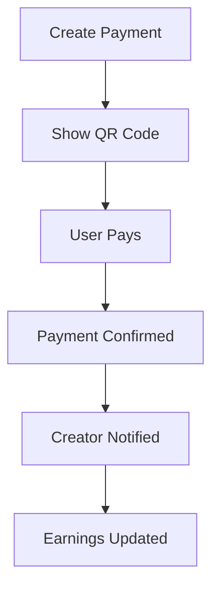

# WIZ NowPayments Tipping Integration Guide

## Phase 2: Enhanced Tipping System ✅

This integration enables crypto tipping on creator private profiles using NowPayments API with USD/USDT dual currency support.

## 🚀 Enhanced Features

- **Dual Currency Support** - USD fiat settlement or USDT (BSC) crypto payments
- **Dynamic Minimum Amounts** - Real-time minimum amounts from NOWPayments API  
- **Fee Transparency** - Clear display of transaction fees paid by sender
- **Auto USD Settlement** - All creator payments settled in USD regardless of payment method
- **Currency Toggle** - Seamless switching between USD and USDT (BSC)
- **Real-time Estimates** - Live fee calculation and payment estimates
- **Custom Tipping UI** - Matches WIZ glassmorphic design
- **QR Code Payments** - Easy mobile wallet scanning
- **Real-time Status** - Live payment tracking
- **Secure Webhooks** - HMAC SHA512 signature verification
- **Creator Earnings** - Automatic tip tracking and notifications

## 🛠 Installation & Setup

### 1. Environment Variables

Add to your `.env.local`:

```env
# NowPayments API Configuration
NOWPAYMENTS_API_KEY=your_nowpayments_api_key
NOWPAYMENTS_IPN_SECRET=your_ipn_secret_key

# Production URLs (for IPN callbacks)
NEXT_PUBLIC_APP_URL=https://wiz-magic-platform.web.app
```

### 2. NowPayments Account Setup

1. **Create Account**: Sign up at [nowpayments.io](https://nowpayments.io)
2. **Get API Key**: Dashboard → API Keys → Generate new key
3. **Set IPN Secret**: Dashboard → IPN Settings → Set secret key
4. **Configure IPN URL**: Set to `https://your-domain.com/api/webhooks/nowpayments/tips`
5. **Whitelist Domain**: Add your domain to authorized origins

### 3. Firestore Collections

The integration creates these collections:

```
tips/
├── [paymentId]
│   ├── paymentId: string
│   ├── creatorId: string
│   ├── amount: number
│   ├── currency: string
│   ├── status: string
│   ├── tipperName?: string
│   ├── message?: string
│   └── createdAt: timestamp

creators/
├── [creatorId]
│   └── earnings/
│       ├── totalTips: number
│       ├── totalTipAmount: number
│       └── lastTipAt: timestamp

notifications/
├── tip_[paymentId]
│   ├── type: 'tip_received'
│   ├── creatorId: string
│   ├── message: string
│   └── createdAt: timestamp
```

## 🎨 UI Components

### Tip Button Integration

The tip button appears next to the XP ring on creator profiles:

```tsx
<TipButton
  creatorId={user.uid}
  creatorName={user.displayName || 'Creator'}
  creatorAvatar={user.photoURL}
  size="md"
  variant="default"
/>
```

### Styling

The components use WIZ's design system:
- **Colors**: Purple to pink gradients
- **Effects**: Glassmorphic backgrounds with backdrop blur
- **Animations**: Smooth transitions with Framer Motion
- **Typography**: Tailwind CSS classes

## 🔧 API Endpoints

| Endpoint | Method | Description |
|----------|--------|-------------|
| `/getNowPaymentsCurrencies` | GET | List supported currencies |
| `/getNowPaymentsMinAmount` | GET | Get minimum amount for currency pair |
| `/getNowPaymentsEstimate` | GET | Get payment estimate with fees |
| `/createNowPaymentsPayment` | POST | Create payment request with USD settlement |
| `/getNowPaymentsStatus` | GET | Get payment status |
| `/nowPaymentsTipWebhook` | POST | IPN webhook handler |

## 🔒 Security Features

### API Key Protection
- API keys stored server-side only
- Client never sees sensitive credentials
- All requests proxied through backend

### IPN Verification
- HMAC SHA512 signature validation
- Request origin verification
- Replay attack prevention

### Data Validation
- Input sanitization
- Amount validation
- Currency code verification

## 📱 User Flow

### 1. Enhanced Tip Flow


### 2. Payment Process


## 🛡 Error Handling

### Frontend
- Network failure fallbacks
- Loading states for all async operations
- User-friendly error messages
- Retry mechanisms

### Backend
- API rate limiting
- Request validation
- Comprehensive logging
- Graceful degradation

## 📊 Analytics & Tracking

### Creator Dashboard
- Total tips received
- Tip amount by currency
- Recent tip activity
- Top supporters

### Platform Analytics
- Total tipping volume
- Popular currencies
- Creator earnings distribution
- Conversion rates

## 🚦 Testing

### Development Testing
```bash
# Start development server
npm run dev

# Test API endpoints
curl http://localhost:3000/api/nowpayments/currencies

# Simulate webhook
curl -X POST http://localhost:3000/api/webhooks/nowpayments/tips \
  -H "Content-Type: application/json" \
  -H "x-nowpayments-sig: test_signature" \
  -d '{"payment_id": "test", "payment_status": "finished"}'
```

### Production Testing
1. Use NowPayments sandbox environment
2. Test with small amounts
3. Verify webhook delivery
4. Check Firestore updates

## 🔄 Phase 2 Roadmap

### Planned Features
- **Recurring Tips** - Subscription-based donations
- **Fiat Settlement** - Convert crypto to USD/EUR
- **Tip Goals** - Creator fundraising targets
- **Anonymous Tips** - Enhanced privacy options
- **Tip Leaderboards** - Top supporters showcase

### Integration Points
- Creator dashboard analytics
- Public profile tip buttons
- Video-specific tipping
- Stream integration

## 🐛 Troubleshooting

### Common Issues

**Issue**: "API configuration error"
**Solution**: Check NOWPAYMENTS_API_KEY environment variable

**Issue**: "Invalid signature" in webhook
**Solution**: Verify NOWPAYMENTS_IPN_SECRET matches NowPayments dashboard

**Issue**: Payments not updating
**Solution**: Check webhook URL accessibility and HTTPS

**Issue**: Currency not supported
**Solution**: Verify currency is in NowPayments supported list

### Debug Mode

Enable detailed logging:
```env
DEBUG=nowpayments:*
NODE_ENV=development
```

## 📞 Support

### NowPayments Support
- Documentation: [docs.nowpayments.io](https://docs.nowpayments.io)
- Support: support@nowpayments.io
- Telegram: @nowpaymentssupport

### WIZ Integration Support
- Check logs in browser console
- Review Firestore collections
- Test API endpoints manually
- Verify environment configuration

## ⚡ Performance Notes

### Optimization Tips
- Cache currency list (5min TTL)
- Batch Firestore updates
- Use connection pooling
- Implement request queuing

### Monitoring
- Track API response times
- Monitor webhook delivery
- Watch error rates
- Alert on failed payments

---

**🎉 Ready to Go!** Your crypto tipping system is now integrated and ready for Phase 2 expansion.